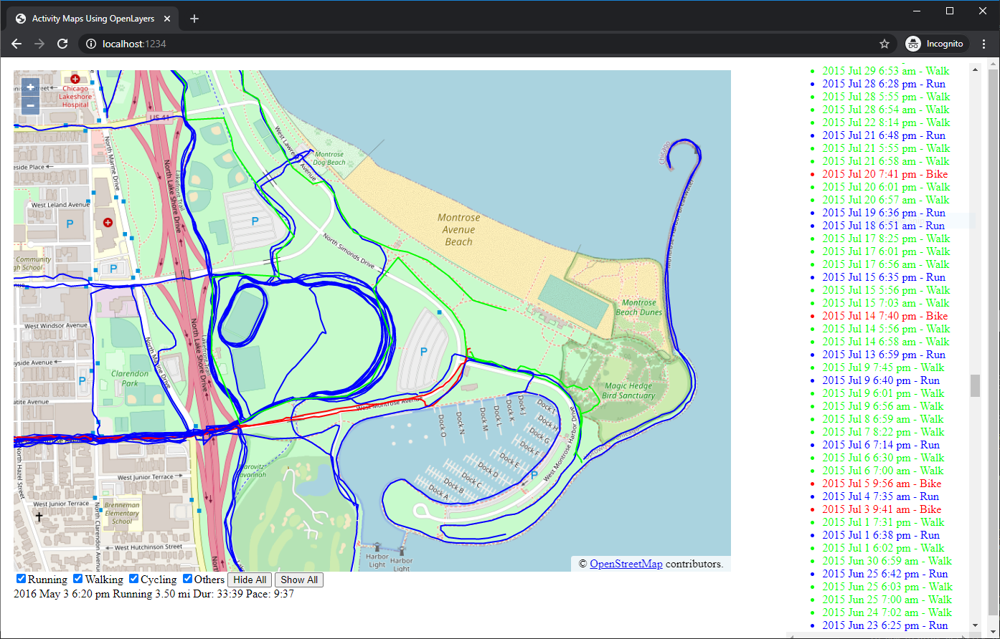

# Activity-Mapper-2
Displays [GPX Activities](https://wiki.openstreetmap.org/wiki/GPX) on an [Open Street Maps](https://wiki.openstreetmap.org/wiki/Main_Page) view using the [Open Layers](https://openlayers.org/) framework.



# Features

* Web-based activity browsing using Open Street Maps (zoom, pan, as usual).
* Capable of displaying *many* activities at the same time
* Activities are color-coded (blue for runs, red for biking, green for walks)
* Mouse over an activity for details (date/time, distance, etc.)
* Click on an individual activity to highlight and see details
* Activity timeline list on the right panel
* Click on the activity from the timeline to highlight and zoom to that activity
* Enable and disable the display of activity categories with the controls at the bottom
* Click and drag while holding shift to draw a rectangle around certain activities.  Details on those activities are displayed.

See [TODO](TODO) file for possible future enhancements.

# Setup

Install [node.js](https://nodejs.org/en/) if you don't have that yet.

Install the node.js package dependencies (parcel and open layers):
```
npm install parcel
npm install ol
```

Copy GPX data files to ./data/gpx/

Copy "cardioActivities.csv" to ./data/csv/

Start the small local parcel web server:
```
npm start
```

Browse to http://localhost:1234

Enjoy your map.

## Note on cardioActivites.csv

cardioActivities is a CSV file with the following header row and one example row:
```
Activity Id,Date,Type,Route Name,Distance (mi),Duration,Average Pace,Average Speed (mph),Calories Burned,Climb (ft),Average Heart Rate (bpm),Friend's Tagged,Notes,GPX File
abababab-abab-abab-abab-abababababab,2020-05-02 15:16:17,Walking,,0.70,12:31,17:17,3.36,62.0,3,,"","",2020-05-02-151617.gpx
```

This is the default csv export format from [Run Keeper](https://runkeeper.com/).  Go to "Account Settings" -> "Export Data" to export your Run Keeper data.
